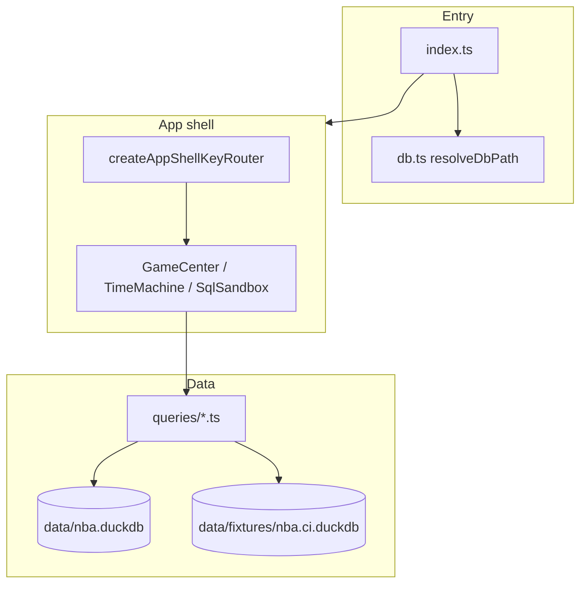

# BBallGenius

[](https://github.com/nickth3man/bballgenius/actions/workflows/ci.yml)

A terminal NBA analytics hub built with **[Bun](https://bun.sh)**, **[OpenTUI](https://github.com/anomalyco/opentui)**, and **[DuckDB](https://duckdb.org)**. Browse recent games and box scores, explore player careers, and run ad‑hoc SQL against a local `nba.duckdb` dataset (~1.5 GB).

## Overview

BBallGenius consolidates three workflows into one keyboard-driven TUI:

| Tab | Shortcut | Purpose |
|-----|----------|---------|
| **Game Center** | `F1` / `1` | Recent games, deduplicated box scores, shot charts |
| **Career Time-Machine** | `F2` / `2` | Player search, dossier, season-by-season stats |
| **SQL Sandbox** | `F3` / `3` | Schema browser and DuckDB query editor |

The app shell (`src/appShell.ts`) owns global key routing, tab visibility, a dynamic status footer, and a `?` help overlay. Each tab implements the `AppShellTab` contract: focus cycling, optional backward focus (`Shift+Tab`), and contextual status lines for the footer.

### Why it exists

- **Single local database** — One DuckDB file powers every tab; no separate services.
- **Terminal-first** — Fast keyboard navigation for analysts who live in the shell.
- **Testable UI** — OpenTUI virtual renderer tests cover routing, ANSI safety, SQL shapes, and golden frames without a real terminal.

### Key terms

- **team_dedup** — SQL CTE that picks the latest franchise name per `team_id` (e.g. Minneapolis → LA Lakers) so box scores do not duplicate players.
- **StyledText** — OpenTUI structured text produced by `ansiToStyledText()` so escape codes do not break layout or leak into `plainText`.
- **Mutation helpers** — Intentionally broken queries in `src/tests/helpers/queries.ts` prove tests catch SQL regressions.
- **CI fixture** — Committed `data/fixtures/nba.ci.duckdb` (~3 MB) subset used for PR integration tests; see [`data/fixtures/README.md`](data/fixtures/README.md).

## Requirements

- [Bun](https://bun.sh) **1.3.6+** (see `packageManager` in `package.json`)
- A terminal that supports ANSI colors (Windows Terminal, iTerm2, etc.)
- **`data/nba.duckdb`** — not included in git (~1.5 GB); see [Database setup](#database-setup)

Optional: set `NO_COLOR=1` for monochrome shot symbols (`o` / `x` / `[o]` / `[x]`) in the half-court plotter.

## Quick start

```bash
git clone https://github.com/nickth3man/bballgenius.git
cd bballgenius
bun install

# Place your DuckDB file at data/nba.duckdb (see below)
bun start
```

On first launch the app connects to `data/nba.duckdb`, renders the hub, and loads Game Center. Press `?` anytime for the full shortcut list.

To run the full test suite locally without the large database:

```bash
bun run ci:integration   # uses committed data/fixtures/nba.ci.duckdb
```

## Database setup

Connection path is resolved in `src/db.ts` via `resolveDbPath()`:

| Priority | Path | When |
|----------|------|------|
| 1 | `process.env.NBA_DUCKDB_PATH` | Explicit override (tests, local scripts) |
| 2 | `data/fixtures/nba.ci.duckdb` | `CI=true` or `GITHUB_ACTIONS=true` and fixture exists |
| 3 | `data/nba.duckdb` | Default for local development and `bun start` |

```ts
import { initDb, resolveDbPath } from './db.js';

await initDb(); // opens resolveDbPath()
```

1. Create the directory: `mkdir -p data`
2. Copy or build `nba.duckdb` into `data/nba.duckdb`

Typical sources:

- Build from the [nbadb](https://github.com/nickth3man/nbadb) pipeline (same schema family as this project).
- Export from an existing DuckDB or Kaggle NBA dataset compatible with tables such as `dim_player`, `dim_game`, `fact_player_game_boxscore`, and `fact_pbp_events`.

If the file is missing, the process exits at startup with a clear DuckDB connection error.

## Keyboard shortcuts

Global shortcuts (also shown in the footer and `?` overlay):

| Key | Action |
|-----|--------|
| `F1`–`F3` or `1`–`3` | Switch tabs |
| `Tab` | Cycle panel focus (skipped while typing in search/SQL) |
| `Shift+Tab` | Cycle focus backward |
| `?` | Toggle help overlay |
| `Esc` | Blur input, close help, or quit |
| `Ctrl+C` | Quit |

**Game Center:** `↑`/`↓` move selection in the focused panel (games or box score). Shot chart follows the selected player.

**Time-Machine:** Type to search (2+ characters). `↑`/`↓` suggestions, `Enter` to load. `Tab` inserts a tab in the search field when the search box is focused.

**SQL Sandbox:** `Ctrl+R` or `Ctrl+E` run query. `↑`/`↓` in schema browser; `Enter` expands tables / inserts column names.

Source of truth for help text: `src/utils/keyboardHelp.ts`.

## Development

### Project layout

```
src/
  index.ts              # Entry: DB init, OpenTUI renderer, app shell
  appShell.ts           # Tabs, key router, footer, help overlay
  db.ts                 # DuckDB path resolution, connection, query helpers
  queries/              # Production SQL (game center, time machine)
  tabs/                 # GameCenterTab, TimeMachineTab, SqlSandboxTab
  utils/                # formatters, theme, keyboardHelp
  tests/                # Bun test suite (unit + integration)
data/
  nba.duckdb            # Full database (gitignored, local only)
  fixtures/
    nba.ci.duckdb       # CI subset (committed, ~3 MB)
scripts/
  build-ci-fixture.ts   # Build nba.ci.duckdb from full database
  ci-guards.sh          # Block .only/.skip and UPDATE_SNAPSHOTS in CI
  apply-branch-protection.sh
```

### Scripts

| Command | Description |
|---------|-------------|
| `bun start` | Run the TUI |
| `bun test src/tests --concurrency=1` | Full suite (requires `data/nba.duckdb` or set `NBA_DUCKDB_PATH`) |
| `bun run test:unit` | DB-free formatter/parser tests |
| `bun run test:regression` | Shell, mutation, visual, golden snapshots |
| `bun run typecheck` | Typecheck entire codebase (`tsconfig.json`) |
| `bun run lint` | Biome lint (`biome ci`) |
| `bun run lint:fix` | Biome check with auto-fix |
| `bun run fixture:build` | Rebuild `data/fixtures/nba.ci.duckdb` from full local DB |
| `bun run ci:integration` | Full test suite against CI fixture |
| `bun run ci` | Local mirror of PR CI (guards, lint, typecheck, unit, integration, audit) |

Always pass `--concurrency=1` for the full suite so DuckDB and OpenTUI tests do not race.

Both application and test code are fully checked with `bun run typecheck` under a unified `tsconfig.json`.

### Updating golden snapshots

Golden frames must be regenerated against the **same database** CI uses:

```bash
NBA_DUCKDB_PATH=data/fixtures/nba.ci.duckdb UPDATE_SNAPSHOTS=1 \
  bun test src/tests/golden_snapshot.test.ts --concurrency=1
```

See [`src/tests/snapshots/README.md`](src/tests/snapshots/README.md).

## Testing

### Tiers

| Tier | Command | Database |
|------|---------|----------|
| **Unit** | `bun run test:unit` | None |
| **Integration** | `bun run ci:integration` or `bun test src/tests --concurrency=1` | CI fixture or full `nba.duckdb` |
| **Regression** | `bun run test:regression` | Same as integration |

The full suite is **80 tests** across 11 files when run with the CI fixture.

### Running locally

```bash
# No database
bun run test:unit

# CI fixture (~80 tests, no 1.5 GB download)
bun run ci:integration

# Full local database
bun test src/tests --concurrency=1
```

### CI

GitHub Actions workflow: [`.github/workflows/ci.yml`](.github/workflows/ci.yml)

Based on the official [Bun + GitHub Actions guide](https://bun.sh/docs/guides/runtime/cicd) (`oven-sh/setup-bun@v2`, `bun-version-file`).

| Job | When | What |
|-----|------|------|
| **guards** | Every push / PR | Reject `.only` / `.skip` in tests; block `UPDATE_SNAPSHOTS=1` |
| **lint** | Every push / PR | `bun run lint` (Biome) |
| **typecheck** | Every push / PR | `bun run typecheck` (unified tsconfig) |
| **unit** | Every push / PR | `bun run test:unit` |
| **integration** | Every push / PR | Full suite against `data/fixtures/nba.ci.duckdb` |
| **audit** | Every push / PR | `bun audit` |
| **CI** (aggregate) | Every push / PR | All of the above must pass — **required on `main`** |
| **integration-full** | Manual `workflow_dispatch` | Full suite against `data/nba.duckdb` (~1.5 GB) |

Run the same checks locally before pushing:

```bash
bun run ci
```

**Branch protection:** `main` requires the **CI** status check. Re-apply with:

```bash
bash scripts/apply-branch-protection.sh
```

**CI fixture:** [`data/fixtures/README.md`](data/fixtures/README.md) — rebuild with `bun run fixture:build` after changing fixture scope.

**Full-database CI:** Actions → CI → Run workflow → enable **Run tests against full data/nba.duckdb**.

## Architecture



**Design decisions**

- **Production SQL lives in `src/queries/`** — Tests import the same functions via `src/tests/helpers/queries.ts` so SQL changes cannot drift from tests.
- **ANSI at the boundary** — Tabs build strings with ANSI for emphasis; `ansiToStyledText()` converts before assigning to `TextRenderable` to keep layout and tests stable.
- **Focus model** — Panel borders use OpenTUI `focusable` + `focusedBorderColor`; lists use `▶` and arrow keys instead of mouse.

## API reference (core modules)

### `resolveDbPath()` / `initDb()` / `query(sql, params?)` — `src/db.ts`

Resolves the DuckDB file path, opens a cached connection, and returns row objects (JSON-safe types).

```ts
import { initDb, query, resolveDbPath } from './db.js';

console.log(resolveDbPath()); // e.g. data/nba.duckdb
await initDb();
const rows = await query('SELECT 1 AS n');
```

Override for tests:

```bash
NBA_DUCKDB_PATH=data/fixtures/nba.ci.duckdb bun test src/tests --concurrency=1
```

Throws if the database file is missing or invalid.

### `createAppShell(renderer)` — `src/appShell.ts`

Builds the hub UI and returns navigation helpers.

```ts
const shell = createAppShell(renderer);
shell.attachKeyHandlers({ onShutdown: async () => { /* cleanup */ } });
await shell.initTabs();
shell.setStatusLine('Ready');
shell.toggleHelp();
```

| Method | Description |
|--------|-------------|
| `switchTab(index)` | Show tab 0–2 and refresh focus |
| `setStatusLine(text)` | Footer center status (also reads `tab.getStatusLine()`) |
| `toggleHelp()` | Show/hide shortcut overlay |
| `routeKeyPress(event)` | Exposed for tests |

### `formatTable` / `drawHalfCourt` / `ansiToStyledText` — `src/utils/formatters.ts`

Terminal table layout, half-court shot plot, and ANSI → `StyledText` parsing. Respects `NO_COLOR` for `drawHalfCourt` when `process.env.NO_COLOR` is set.

## Common pitfalls

- **Running tests without `--concurrency=1`** — Can cause flaky DuckDB or OpenTUI failures.
- **Committing `data/nba.duckdb`** — Gitignored on purpose; never add the 1.5 GB file. The CI fixture (`data/fixtures/nba.ci.duckdb`) is committed instead.
- **Expecting Tab to type in SQL/search** — Global Tab cycles panels only when the input is not focused; use Tab inside the field while typing.
- **Golden snapshot drift** — Regenerate with `NBA_DUCKDB_PATH=data/fixtures/nba.ci.duckdb` so snapshots match CI; review the diff before committing.
- **Fixture out of date** — After changing queries or test data needs, run `bun run fixture:build` and `bun run ci`.

## Related projects

- [nickth3man/nbadb](https://github.com/nickth3man/nbadb) — NBA data extraction and DuckDB build pipeline
- [anomalyco/opentui](https://github.com/anomalyco/opentui) — Terminal UI framework

## License

No license file is specified yet. Treat as source-available until a license is added.
