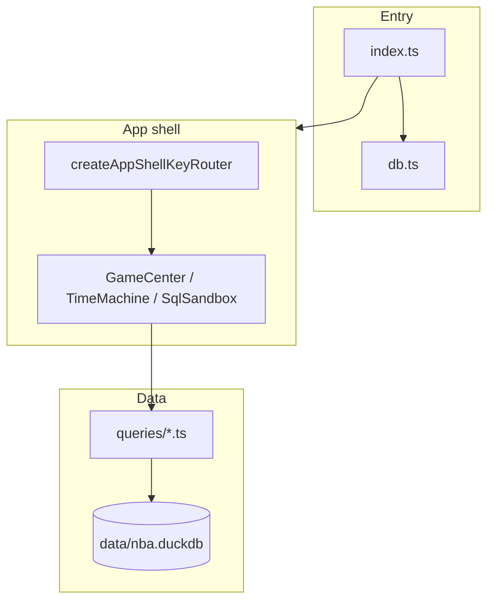

# BBallGenius

[](https://github.com/nickth3man/bballgenius/actions/workflows/ci.yml)

A terminal NBA analytics hub built with **[Bun](https://bun.sh)**, **[OpenTUI](https://github.com/anomalyco/opentui)**, and **[DuckDB](https://duckdb.org)**. Browse recent games and box scores, explore player careers, and run ad‑hoc SQL against a local `nba.duckdb` dataset (~1.5 GB).

## Overview

BBallGenius consolidates three workflows into one keyboard-driven TUI:

| Tab | Shortcut | Purpose |
|-----|----------|---------|
| **Game Center** | `F1` / `1` | Recent games, deduplicated box scores, shot charts |
| **Career Time-Machine** | `F2` / `2` | Player search, dossier, season-by-season stats |
| **SQL Sandbox** | `F3` / `3` | Schema browser and DuckDB query editor |

The app shell (`src/appShell.ts`) owns global key routing, tab visibility, a dynamic status footer, and a `?` help overlay. Each tab implements the `AppShellTab` contract: focus cycling, optional backward focus (`Shift+Tab`), and contextual status lines for the footer.

### Why it exists

- **Single local database** — One DuckDB file powers every tab; no separate services.
- **Terminal-first** — Fast keyboard navigation for analysts who live in the shell.
- **Testable UI** — OpenTUI virtual renderer tests cover routing, ANSI safety, SQL shapes, and golden frames without a real terminal.

### Key terms

- **team_dedup** — SQL CTE that picks the latest franchise name per `team_id` (e.g. Minneapolis → LA Lakers) so box scores do not duplicate players.
- **StyledText** — OpenTUI structured text produced by `ansiToStyledText()` so escape codes do not break layout or leak into `plainText`.
- **Mutation helpers** — Intentionally broken queries in `src/tests/helpers/queries.ts` prove tests catch SQL regressions.

## Requirements

- [Bun](https://bun.sh) **1.3.6+** (see `packageManager` in `package.json`)
- A terminal that supports ANSI colors (Windows Terminal, iTerm2, etc.)
- **`data/nba.duckdb`** — not included in git (~1.5 GB); see [Database setup](#database-setup)

Optional: set `NO_COLOR=1` for monochrome shot symbols (`o` / `x` / `[o]` / `[x]`) in the half-court plotter.

## Quick start

```bash
git clone https://github.com/nickth3man/bballgenius.git
cd bballgenius
bun install

# Place your DuckDB file at data/nba.duckdb (see below)
bun start
```

On first launch the app connects to `data/nba.duckdb`, renders the hub, and loads Game Center. Press `?` anytime for the full shortcut list.

## Database setup

The database path is fixed in `src/db.ts`:

```ts
DuckDBInstance.fromCache('data/nba.duckdb');
```

1. Create the directory: `mkdir -p data`
2. Copy or build `nba.duckdb` into `data/nba.duckdb`

Typical sources:

- Build from the [nbadb](https://github.com/nickth3man/nbadb) pipeline (same schema family as this project).
- Export from an existing DuckDB or Kaggle NBA dataset compatible with tables such as `dim_player`, `dim_game`, `fact_player_game_boxscore`, and `fact_pbp_events`.

If the file is missing, the process exits at startup with a clear DuckDB connection error.

## Keyboard shortcuts

Global shortcuts (also shown in the footer and `?` overlay):

| Key | Action |
|-----|--------|
| `F1`–`F3` or `1`–`3` | Switch tabs |
| `Tab` | Cycle panel focus (skipped while typing in search/SQL) |
| `Shift+Tab` | Cycle focus backward |
| `?` | Toggle help overlay |
| `Esc` | Blur input, close help, or quit |
| `Ctrl+C` | Quit |

**Game Center:** `↑`/`↓` move selection in the focused panel (games or box score). Shot chart follows the selected player.

**Time-Machine:** Type to search (2+ characters). `↑`/`↓` suggestions, `Enter` to load. `Tab` inserts a tab in the search field when the search box is focused.

**SQL Sandbox:** `Ctrl+R` or `Ctrl+E` run query. `↑`/`↓` in schema browser; `Enter` expands tables / inserts column names.

Source of truth for help text: `src/utils/keyboardHelp.ts`.

## Development

### Project layout

```
src/
  index.ts              # Entry: DB init, OpenTUI renderer, app shell
  appShell.ts           # Tabs, key router, footer, help overlay
  db.ts                 # DuckDB connection and query helpers
  queries/              # Production SQL (game center, time machine)
  tabs/                 # GameCenterTab, TimeMachineTab, SqlSandboxTab
  utils/                # formatters, theme, keyboardHelp
  tests/                # Bun test suite (unit + integration)
```

### Scripts

| Command | Description |
|---------|-------------|
| `bun start` | Run the TUI |
| `bun test src/tests --concurrency=1` | Full suite (requires DB) |
| `bun run test:unit` | DB-free formatter/parser tests |
| `bun run test:regression` | Shell, mutation, visual, golden snapshots |

Always pass `--concurrency=1` for the full suite so DuckDB and OpenTUI tests do not race.

`bunx tsc --noEmit` typechecks application code under `src/` (test files are excluded from `tsconfig.json` because they use OpenTUI test mocks).

### Updating golden snapshots

```bash
UPDATE_SNAPSHOTS=1 bun test src/tests/golden_snapshot.test.ts --concurrency=1
```

See `src/tests/snapshots/README.md`.

## Testing

### Tiers

1. **Unit** (`test:unit`) — `formatters.test.ts` only; safe for CI without the database.
2. **Integration** — All files under `src/tests/`; opens `data/nba.duckdb` in `beforeAll` hooks.
3. **Regression** (`test:regression`) — App shell wiring, mutations, visual frames, golden snapshot.

### Running locally

```bash
# No database required
bun run test:unit

# Full suite (~80 tests) with database present
bun test src/tests --concurrency=1
```

### CI

GitHub Actions workflow: [`.github/workflows/ci.yml`](.github/workflows/ci.yml)

Based on the official [Bun + GitHub Actions guide](https://bun.sh/docs/guides/runtime/cicd) (`oven-sh/setup-bun@v2`, `bun-version-file`).

| Job | When | What |
|-----|------|------|
| **unit** | Every push / PR | `bun run test:unit` |
| **typecheck** | Every push / PR | `bunx tsc --noEmit` |
| **integration** | Manual `workflow_dispatch` only | Full suite + regression (needs `data/nba.duckdb` on the runner) |

To run integration tests in Actions: use **Actions → CI → Run workflow**, enable **Run full test suite**, and ensure the runner workspace contains `data/nba.duckdb` (e.g. self-hosted runner or a future download step). PR checks do not require the 1.5 GB artifact.

## Architecture



**Design decisions**

- **Production SQL lives in `src/queries/`** — Tests import the same functions via `src/tests/helpers/queries.ts` so SQL changes cannot drift from tests.
- **ANSI at the boundary** — Tabs build strings with ANSI for emphasis; `ansiToStyledText()` converts before assigning to `TextRenderable` to keep layout and tests stable.
- **Focus model** — Panel borders use OpenTUI `focusable` + `focusedBorderColor`; lists use `▶` and arrow keys instead of mouse.

## API reference (core modules)

### `initDb()` / `query(sql, params?)` — `src/db.ts`

Opens a cached DuckDB connection to `data/nba.duckdb` and returns row objects (JSON-safe types).

```ts
import { initDb, query } from './db.js';

await initDb();
const rows = await query('SELECT 1 AS n');
```

Throws if the database file is missing or invalid.

### `createAppShell(renderer)` — `src/appShell.ts`

Builds the hub UI and returns navigation helpers.

```ts
const shell = createAppShell(renderer);
shell.attachKeyHandlers({ onShutdown: async () => { /* cleanup */ } });
await shell.initTabs();
shell.setStatusLine('Ready');
shell.toggleHelp();
```

| Method | Description |
|--------|-------------|
| `switchTab(index)` | Show tab 0–2 and refresh focus |
| `setStatusLine(text)` | Footer center status (also reads `tab.getStatusLine()`) |
| `toggleHelp()` | Show/hide shortcut overlay |
| `routeKeyPress(event)` | Exposed for tests |

### `formatTable` / `drawHalfCourt` / `ansiToStyledText` — `src/utils/formatters.ts`

Terminal table layout, half-court shot plot, and ANSI → `StyledText` parsing. Respects `NO_COLOR` for `drawHalfCourt` when `process.env.NO_COLOR` is set.

## Common pitfalls

- **Running tests without `--concurrency=1`** — Can cause flaky DuckDB or OpenTUI failures.
- **Committing `data/nba.duckdb`** — Gitignored on purpose; never add the 1.5 GB file.
- **Expecting Tab to type in SQL/search** — Global Tab cycles panels only when the input is not focused; use Tab inside the field while typing.
- **Golden snapshot drift** — Intentional UI changes require `UPDATE_SNAPSHOTS=1` and a careful diff review.
- **CI integration without the DB** — Default PR CI runs unit + typecheck only; full tests are manual dispatch.

## Related projects

- [nickth3man/nbadb](https://github.com/nickth3man/nbadb) — NBA data extraction and DuckDB build pipeline
- [anomalyco/opentui](https://github.com/anomalyco/opentui) — Terminal UI framework

## License

No license file is specified yet. Treat as source-available until a license is added.
